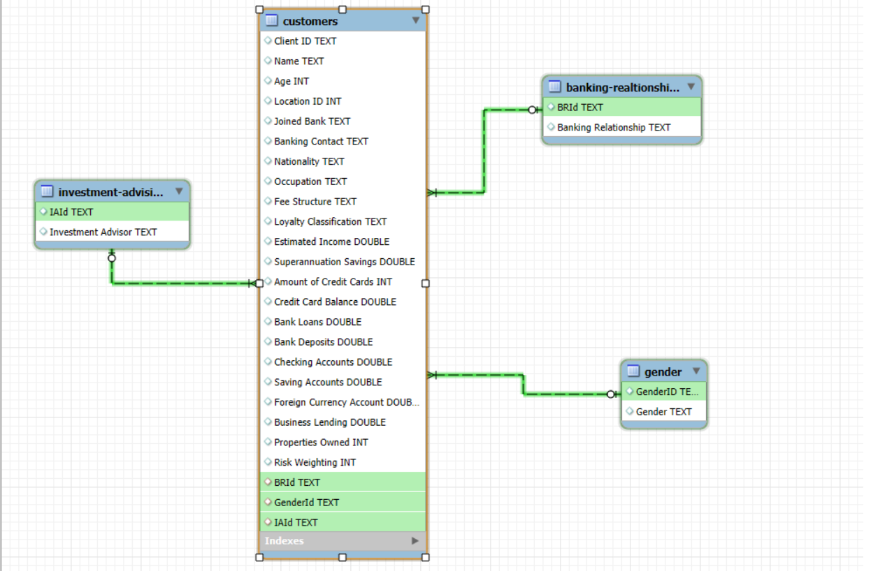
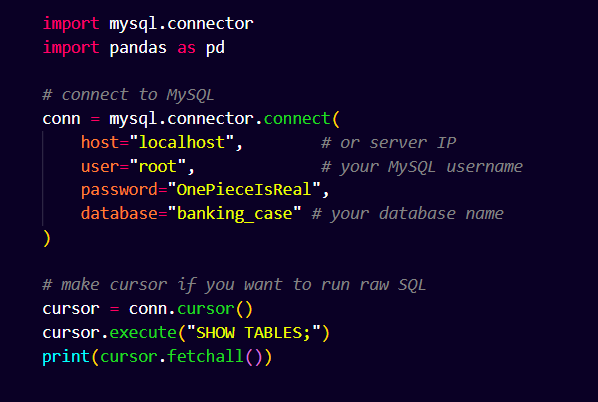
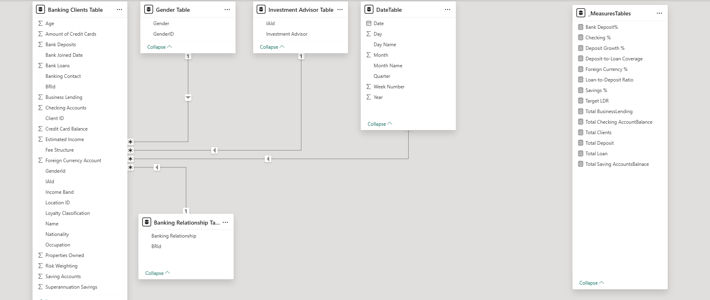
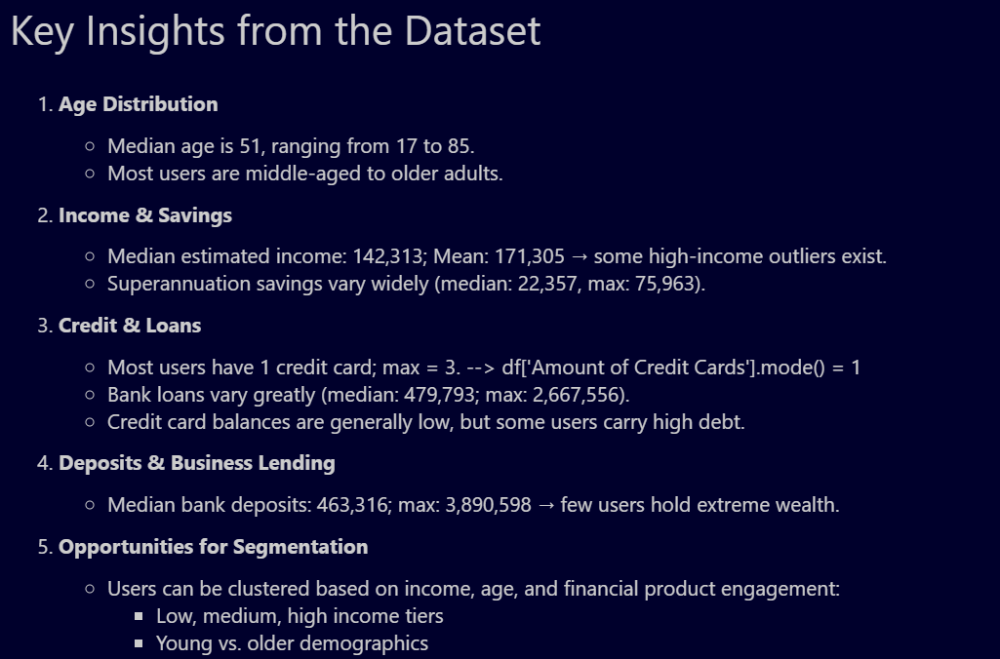
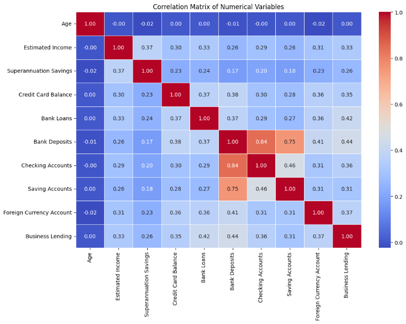

# 🏦 Loan & Deposit Analysis Dashboard (End-to-End Data Analytics Project)

> [📊 View interactive dashboard here on the Power BI Service](https://app.powerbi.com/reportEmbed?reportId=26a1a8b8-afd3-41fd-bc0f-4dc2f3aaeed2&autoAuth=true&ctid=d0732ed6-a89f-488d-b29d-e5e9e7cdde5c)

> *Note: You may need to be signed into your institutional Microsoft account to view the dashboard.*

## 📌 Problem Statement

Banks today handle vast amounts of customer and financial data — ranging from personal details to credit history, deposits, loans, and advisor relationships. However, this information often sits in silos across multiple systems, making it challenging to generate integrated insights on client behavior, loan performance, deposit trends, and financial risks.

The objective of this project was to consolidate multiple banking datasets, perform exploratory data analysis (EDA), and build an interactive Power BI dashboard that enables financial stakeholders to monitor KPIs such as loan-to-deposit ratios, deposit-to-loan ratios risk exposure, client segmentation, and advisor performance.

## ✅ Solution

- This project demonstrates the end-to-end data analytics workflow:

- Data was ingested into MySQL and connected to Python (Jupyter Notebook) for cleaning and EDA.

- Extensive Exploratory Data Analysis (EDA) was conducted to derive client-level and portfolio-level insights.

- A data model was created in Power BI connecting multiple tables using primary/foreign key relationships.

- Finally, interactive dashboards were built and published to the Power BI  Service, offering loan, deposit, and risk analysis views.

## Dataset Info

This dataset contains information about banking clients, their accounts, loans, deposits, and advisor relationships. Multiple tables are linked via primary and foreign keys.

- Banking Relationship Table → Type of client relationship (Retail, Institutional, Commercial, etc.)

- Banking Clients Table → Core client details (loans, deposits, accounts, properties, loyalty, etc.)

- Gender Table → Client gender mapping

- Investment Advisor Table → Mapping of clients to investment advisors

##
# **🔄 Project Workflow**

**📥 Creating the MySQL Database**

- Imported raw banking data into MySQL.

- Verified relational integrity between tables.

**🐍 Connecting Python/Jupyter Notebook**

- Used mysql.connector / SQLAlchemy to fetch data.

- Conducted EDA using Pandas, Matplotlib, Seaborn.

**📊 Exploratory Data Analysis (EDA)**

- Summary statistics for loans, deposits, and client behavior.

- Correlation analysis of numerical features (e.g., Loans vs Deposits).

- Bivariate analysis with gender, loyalty classification, and nationality.

<!-- Add scatter plots / distribution screenshots -->

**📐 Data Modeling in Power BI**

- Created relationships between Banking Clients, Gender, Banking Relationship, and Advisors.

- Defined key DAX measures for Loans, Deposits, Ratios, and KPIs.

**📈 Dashboard Development & Publishing**

- Designed dashboards for Loan Analysis, Deposit Analysis, and Summary Views.

- Published to Power BI Service for online access.

<!-- Add gif or screenshot of published dashboard -->

## 🔍 Exploratory Data Analysis (EDA)

**Summary Statistics**

- Performed **Univariate Analysis** and **Bivariate Analysis**.

- Some of the important calculations performed:

- Total Loan = Bank Loans + Business Lending + Credit Card Balance

- Total Deposit = Checking + Saving + Bank Deposits + Foreign Currency Accounts

- Loan-to-Deposit Ratio (LDR) → 1.23 (Total Loan / Total Deposit)

- Deposit-to-Loan Ratio → 0.86 (Total Deposit / Total Loan)

- High LDR andLow DTR indicate higher risk exposure

- Foreign Currency % in Deposits → ~2.38% of total deposits

**📌 Key Insights from EDA:**
- **Bank Deposits and Checking Accounts** move together strongly—customers with more deposits usually have bigger checking account balances.  

- **Loan-to-Deposit Ratio** is high, and **Deposit-to-Loan Ratio** is low.
- **Strong correlation** between Checking Accounts and Bank Deposits.

> 💡 **Overall:** Most correlations are intuitive—customers with higher financial activity in one area (deposits, loans, accounts) tend to be active in related areas too.

## 📊 Dashboard Structure

The Power BI Dashboard was structured into four main sections:

🏠 Home Page → KPI overview and navigation panel.

💰 Loan Analysis → Loan portfolio breakdown (Bank Loans, Business Lending, Credit Card Balances), Loan-to-Deposit Ratio.

Key metrics: Loan-to-Deposit Ratio, High-risk clients.

💵 Deposit Analysis → Deposit portfolio, Foreign Currency %, client savings behavior.

Key metrics: Deposit-to-Loan Ratio, % of Foreign Currency in Deposits.

📑 Summary Page → Executive-level insights across loans & deposits with key metrics.

## 📐 Data Modeling & DAX

The Power BI model established relationships across the four datasets (Clients, Gender, Advisors, Relationships).

**Some important measures:**

>Total Loan = [Bank Loan] + [Business Lending] + [Credit Cards Balance]

>Total Deposit = [Bank Deposit] + [Savings Account] + [Foreign Currency Account] + [Checking Accounts]

>Loan-to-Deposit Ratio = DIVIDE([Total Loan],[Total Deposit], 0)

>Deposit-to-Loan Ratio = DIVIDE([Total Deposit],[Total Loan], 0)

>Foreign Currency % = DIVIDE(SUM('Banking Clients Table'[Foreign Currency Account]),[Total Deposit], 0)

>These formulas are based on banking domain knowledge
<!-- Add more of your custom measures here -->

# **🛠️ Skills Showcased**

- **SQL (MySQL database creation, relational modeling)**

- **Python (EDA) → Pandas, Seaborn, Matplotlib**

- **Data Cleaning & Feature Engineering**

- **Statistical Analysis & Correlation Study**

- **Power BI Data Modeling & DAX**

- **Dashboard Design & Storytelling**

- **Slicers, KPI Indicators & Tables**

- **Interactive Reporting**

- **Power BI Service Publishing & Sharing**

##
# 🏁 Conclusion

This project demonstrates the end-to-end journey of a data analysis project — from raw banking data to actionable insights.

-    It helped me strengthen skills in:

-    Managing relational databases (SQL)

-    Performing deep-dive exploratory analysis (Python)

-    Creating powerful interactive dashboards (Power BI)

-    Most importantly, it reinforced the structured workflow of an end-to-end project:
>  Data → EDA → Modeling → Dashboard → Publishing.